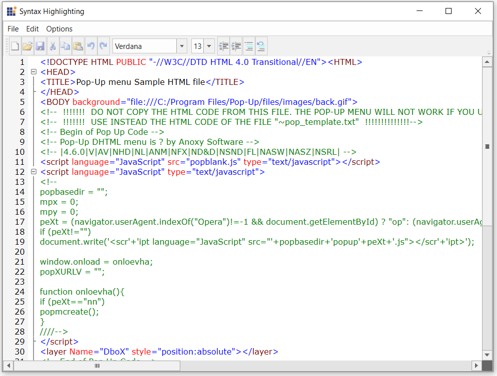
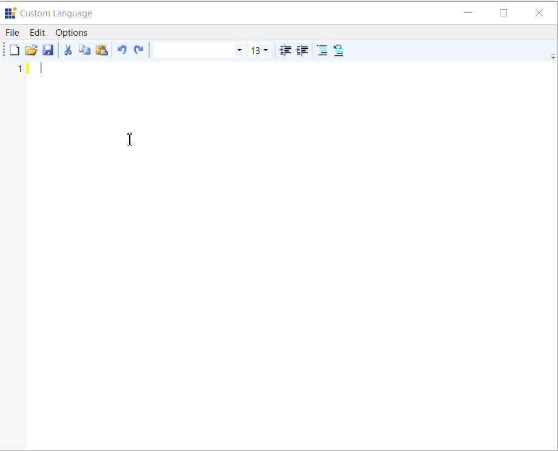

# How to display formatted html in WPF EditControl
This repository contains the sample that shows how to display formatted html in WPF EditControl

The DocumentLanguage property of the EditControl enables the users to select and display the language. To display a html file, the  DocumentLanguage enum type property value can be set to HTML. 

The below lines of code explain to display the formatted html file while loading itself using DocumentSource property in WPF EditControl.

```XAML:

<syncfusion:EditControl Name="Edit1" Background="White" DocumentLanguage="HTML" DocumentSource="../../Utlis/HTMLSource.html"/>
```

```C#:

EditControl edit1 = new EditControl() { Background = Brushes.White, DocumentLanguage=Languages.HTML,DocumentSource= "../../Utlis/HTMLSource.html" };
this.Content = edit1;
```
Output:
 


The below lines of code explain to display the formatted html at runtime in WPF EditControl
```XAML:

<syncfusion:EditControl Name="Edit1" Background="White" DocumentLanguage="HTML" />
```

```C#:

EditControl edit1 = new EditControl() { Background = Brushes.White, DocumentLanguage=Languages.HTML };
this.Content = edit1;
```

Output



